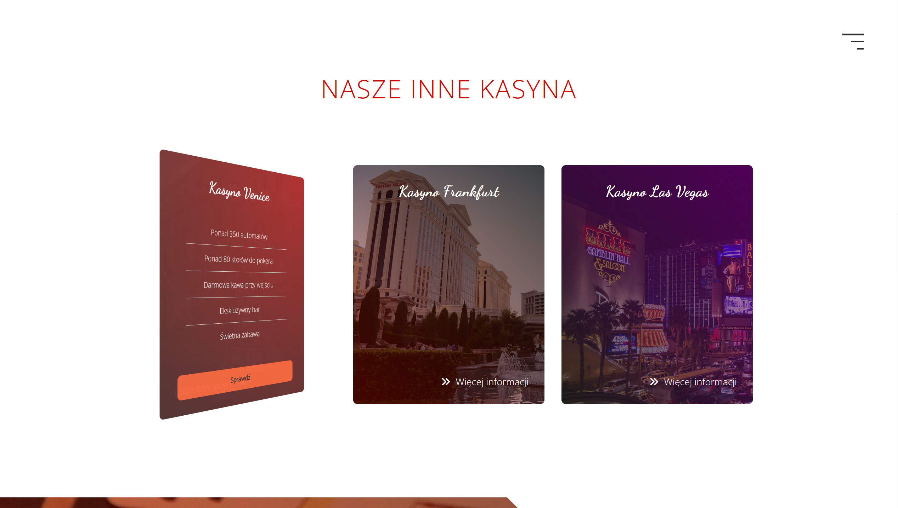
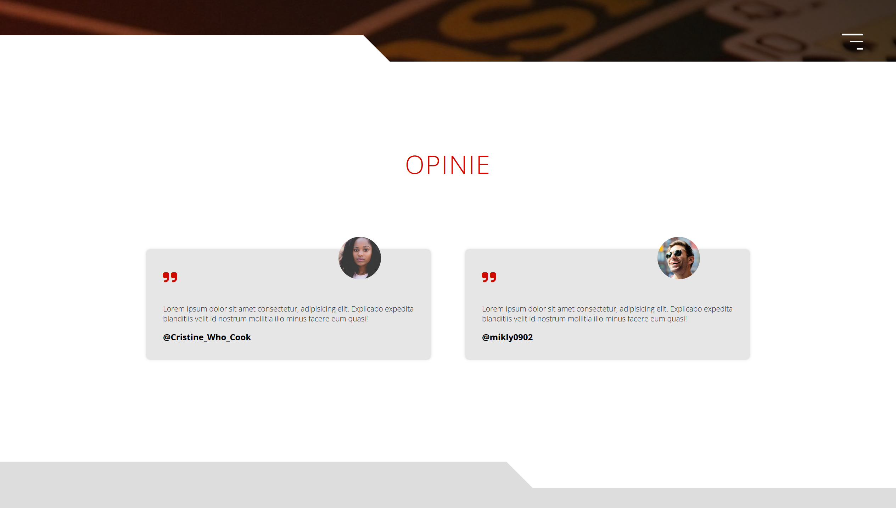
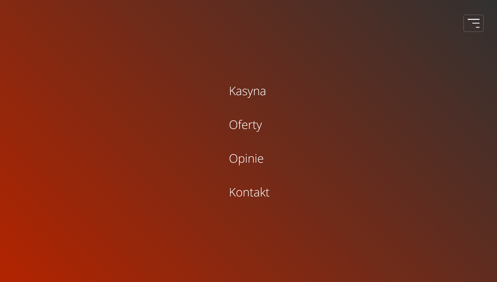

# Tropical Paradise

## Screenshots

    </img>
     
    </img>
     
    </img>
     
    </img>

## Description

- **Mobile first strategy used!**
- Website of a (hypothetical) company called Tropical Paradise that offers holiday destinations!
- Project is a one-page type of website, with sections like Islands, Services, Opinions, Contact.
- Each section has either blue or white background, and Navbar (hamburger) change it's color to opposite to the one he is currently on, which  makes it always visiable to user.
- In the Opinions section, there is a carousel with opinions from (hypothetical) guests. Each opinion is a hand-made card with a profile picture, user name and comment content.

#### Technology used:
- HTML, CSS, JS
- SCSS
- SCSS Mixins
- (Mastering Flexbox skills)

## What I Learned

- Using most important **SEO tags** in modern websites.
- Using SCSS in a bigger project with many classes.
- Creating, importing and using Mixins.
- Creating hero-images and sliders of images.
- Creating semi-advanced animations to the cards, buttons and navigation popup.
- Destructuring website to the small components.
- Creating nav button that changes its color depending on the background on which it is located.

## Author info

- **Name:** Filip Bereszyński
- **Age:** 21 years old
- **Contact:**
    - bereszynski.filip@gmail.com
    - (+48) 510 240 074